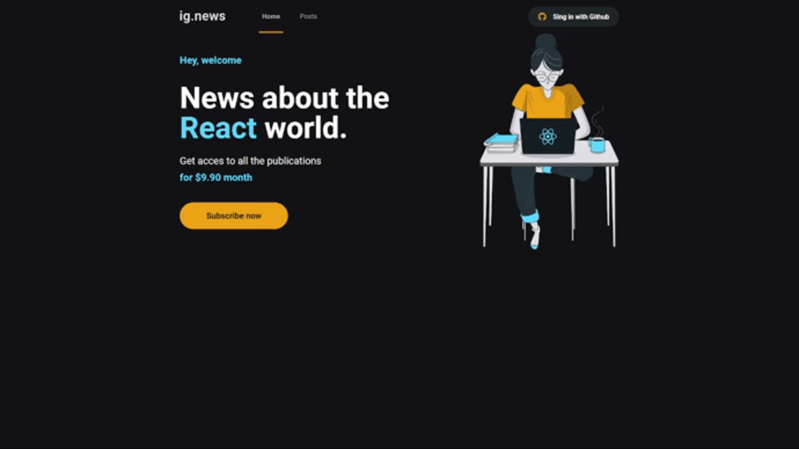

<h1 align="center">


</h1>

<p align="center">
  IGNEWS - News Portal 📰🚀
  <br>
  <br>

  

  <a href="https://rocketseat.com.br">
    
  </a>

  <a href="https://www.linkedin.com/in/Luizrtr/">
    
  </a>

  <a href="https://github.com/Luizrtr/ignews/commits/main">
    
  </a>

  
</p>

---

<p align="center">
  <a href="#dart-about">About</a> &#xa0; | &#xa0; 
  <a href="#rocket-technologies">Technologies</a> &#xa0; | &#xa0;
  <a href="#white_check_mark-requirements">Requirements</a> &#xa0; | &#xa0;
  <a href="#checkered_flag-starting">Starting</a> &#xa0; &#xa0; | &#xa0;
  <a href="#framed_picture-images">Images</a> &#xa0; &#xa0;
</p>

<br>

## :dart: About ##

The project ig.news is blog where users they can access to content in accordance with a status in yout signature.<br>
The blog it has a purchase system integrated with Stripe and after  user to do payment, your signature will be active and ready for read of content complete. Case of user not want choose signature, he will have access limited to content of post. And all data required for to do signature verification
or data of users, They are saves in database FaunaDB.
<br>
<br>
That is an application Serverless, that is, the entire process that would depend in a back-end was integrated inside Front and follow the standard in JAMStack.
<br>
These posts are made by the panel in Prismic CMS and integrated for front-end.

## :rocket: Technologies ##

The following technologies were used in project:

- [Next.js](https://nextjs.org/)
- [Prismic CMS](https://prismic.io/)
- [Stripe](https://stripe.com/)
- [FaunaDB](https://fauna.com/)

## :white_check_mark: Requirements ##

- [Node](https://nodejs.org/en/)
- [Yarn](https://yarnpkg.com/lang/en/)

## :checkered_flag: Starting ##

```bash
# Clone this project
$ git clone https://github.com/Luizrtr/ignews

# Access
$ cd ignews

# Install dependencies
$ yarn install

# Run the project
$ yarn dev

# The server will initialize in the <http://localhost:3000>
```
## :framed_picture: Images ##

<h1 align="center">
    
    
</h1>


