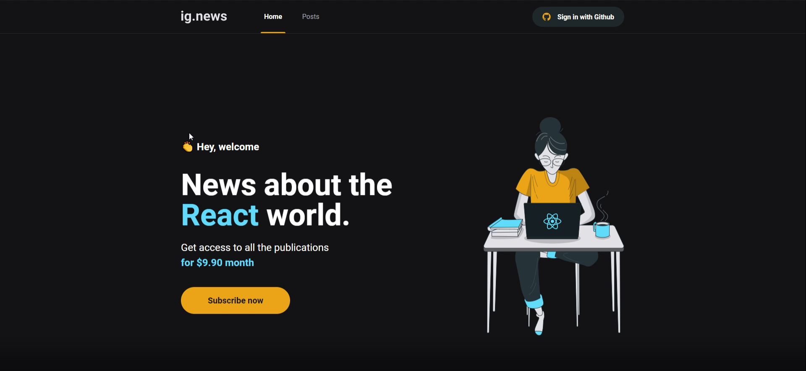
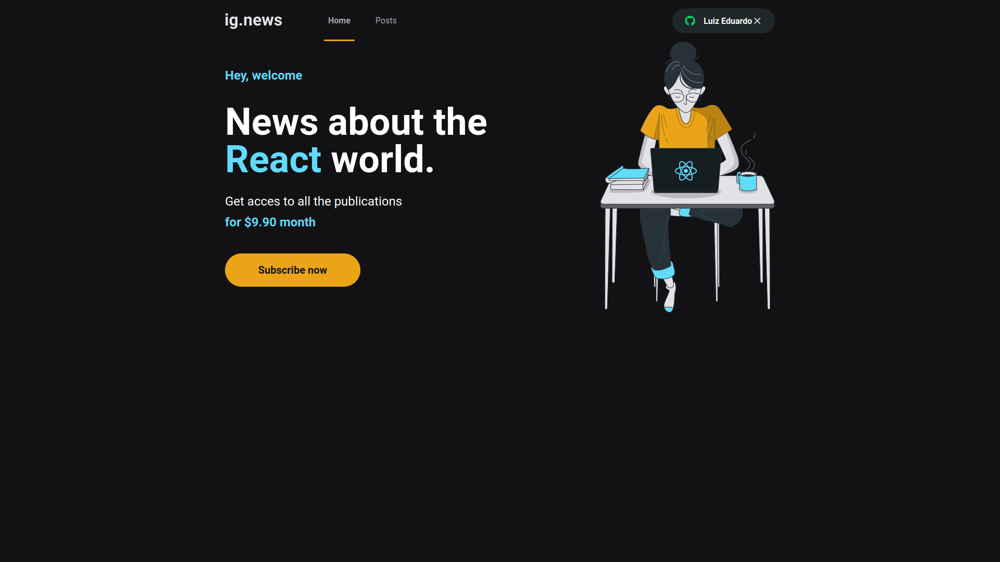
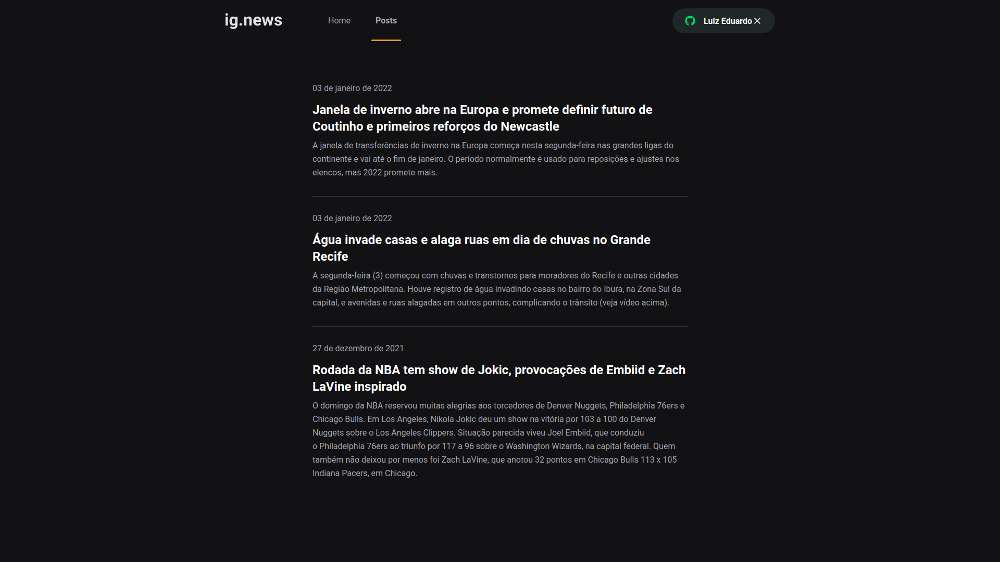
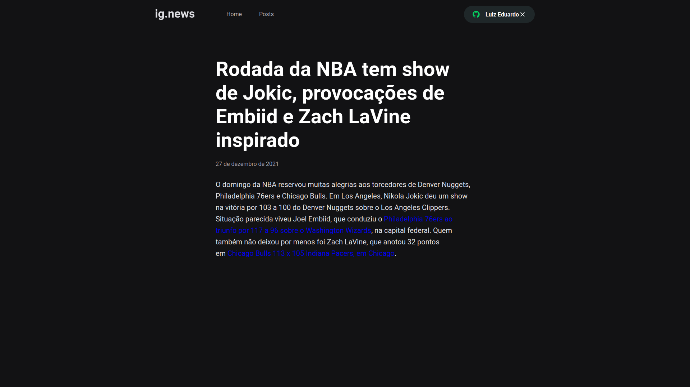

<h1 align = "center">

</h1>

  IGNEWS - Portal de notícias 📰🚀
   
   

  

  

  

  

  

---

  <a href="#dart-sobre"> Sobre </a> & # xa0; | & # xa0; 
  <a href="#rocket-tecnologias"> Tecnologias </a> & # xa0; | & # xa0;
  <a href="#white_check_mark-requerimentos"> Requerimentos </a> & # xa0; | & # xa0;
  <a href="#checkered_flag-começando"> Começando </a> & # xa0;  & # xa0; | & # xa0;
  <a href="#framed_picture-imagens"> Imagens </a> & # xa0;  & # xa0;

 

## : dardo : Sobre

O projeto ig.news é um blog onde os usuários podem ter acesso ao conteúdo de cada postagem de acordo com o status de sua assinatura.  
O blog possui um sistema de compra integrado com o STRIPE, e após o usuário realizar o pagamento, sua candidatura disponível e pronta para visualizar o conteúdo completo
de fazer o blog. Caso o usuário não deseje criar pela assinatura, ele terá acesso limitado ao conteúdo das postagens. E todos os dados identificados para se fazer verificações
de assinaturas ou dados dos usuários, estão salvos no banco de dados FaunaDB.
 
 
Essa é uma aplicação sem servidor, ou seja, todo o processo que dependeria de um backend foi integrado dentro do front e seguindo o padrão do JAMStack.
 
As postagens são feitas pelo painel do Prismic CMS e integradas diretamente pelo frontal.

## : rocket : Tecnologias

As seguintes tecnologias foram utilizadas no projeto:

- [ Next.js ] (https://nextjs.org/)
- [ Prismic CMS ] (https://prismic.io/)
- [ Stripe ] (https://stripe.com/)
- [ FaunaDB ] (https://fauna.com/)

## : white_check_mark : Requerimentos

- [ Nó ] (https://nodejs.org/en/)
- [ Yarn ] (https://yarnpkg.com/lang/en/)

## : checkered_flag : Começando

`` `bash

# Clone este projeto

$ git clone https://github.com/Luizrtr/ignews

# Acesso

$ cd ignews

# Instalar dependências

$ yarn install

# Execute o projeto

$ yarn dev

# O servidor irá inicializar no <http: // localhost: 3000>

`` `

## : framed_picture: Imagens

<h1 align = "center">
    
    
    
    
</h1>
